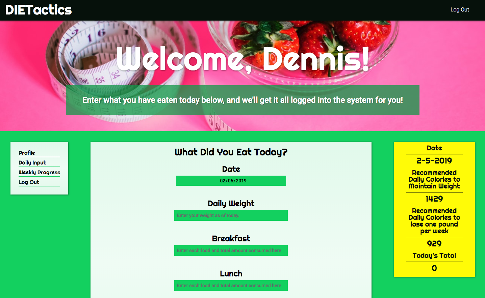
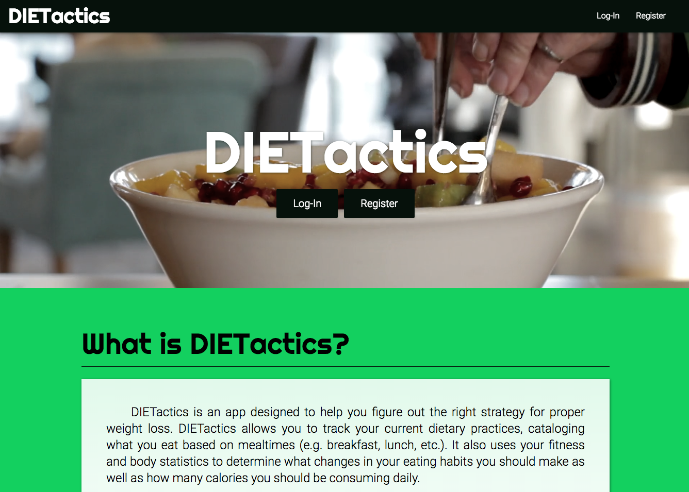
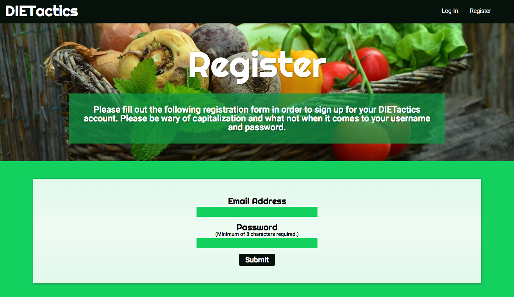
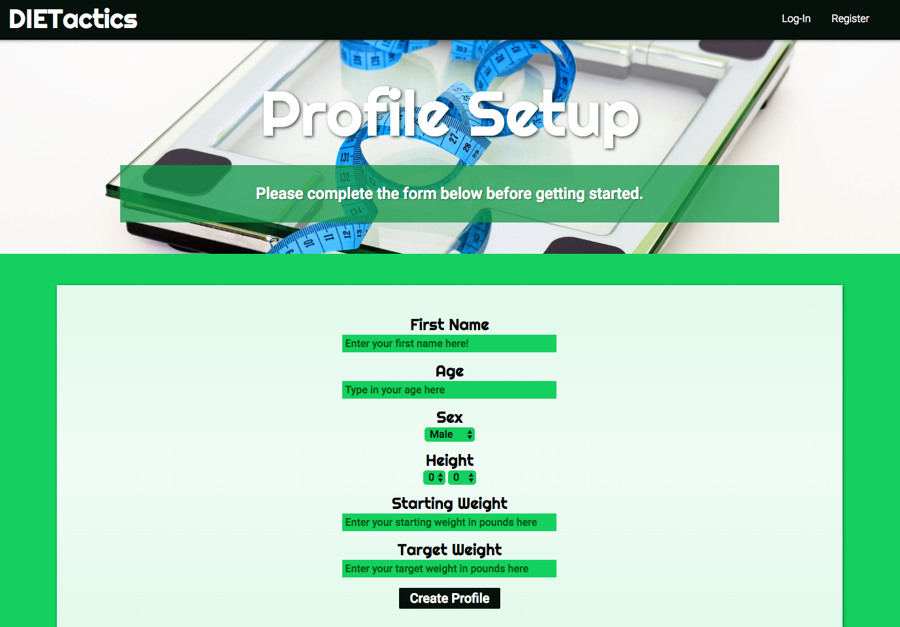
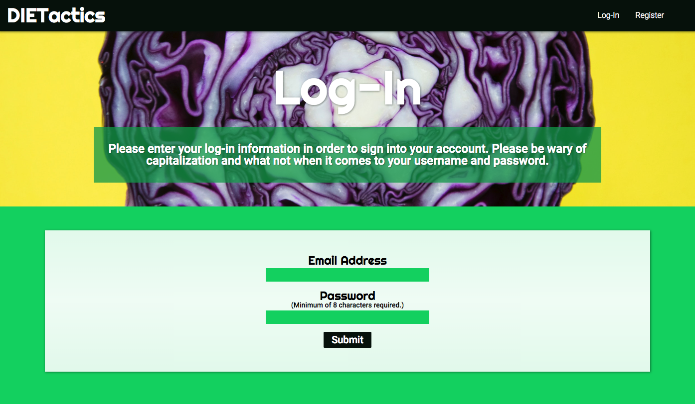
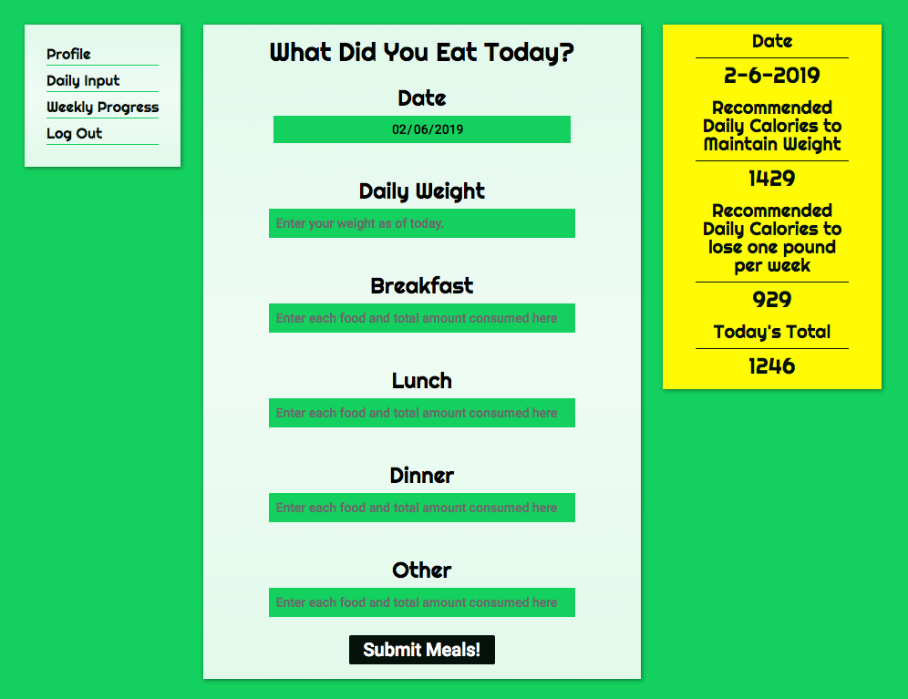
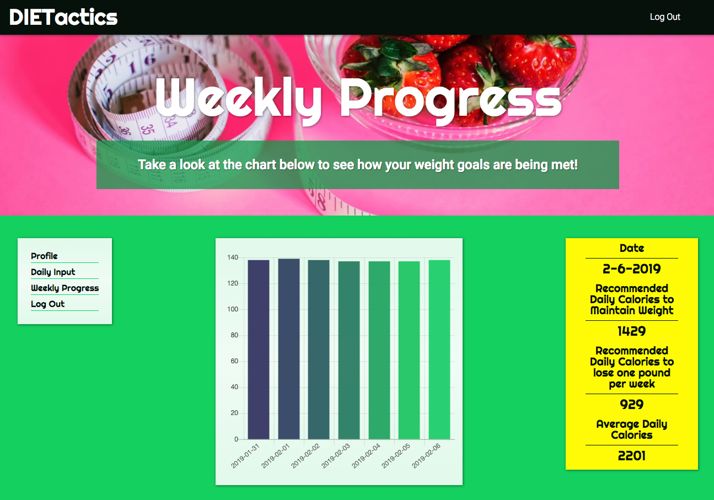

# DIETactics


## Contents
    * Description
    * Features
    * Technologies
    * Challenges and Solutions
    * MVP
    * Stretch Goals
    * Authors
    * Screenshots

## Description
This project is a Node/Express-based application that allows users to create diet plans based on their input (current weight, height, target weight, etc.). Users can log into their profile and view/update their progress on their current diet.

### Features
* Creates a customizable profile for any and all users.
* Calculates recommended daily caloric intake for maintaining weight and for losing/gaining 1 pound per week based on the user's profile.
    * Uses the Harris-Benedict equation to make said calculation.
* Creates a chart for the user that shows their daily weight for the most recent 7 days using Chart.js.
* Uses the Nutritionix API in order to calculate daily calories based on what input the user provides for each meal.

## Technologies
* HTML/CSS/JavaScript
* Node/Express
* MySQL
* Chart.js
* Nutritionix API

## Challenges and Solutions
* Table Structure
    * Initially we had decided upon having two tables to store information for single users: one for basic log-in information, and one for all of the statistics needed for the app. Upon further inspection, though, we realized that it would be more efficient and organized to consolidate all of that information into one single table. We then needed to reformat our initial queries to input registration information into the database and get said information for the profile creation process.
* Using Queries to Populate Profile Update Form
    * For the user form to update a user's profile, we needed to populate said form with all of the current values for every editable record. The issue we came into was that some of the form inputs were select elements, meaning that there was no editable text involved with those inputs. To work with this type of structure, we included an if statement in Node for each individual option element that works with a ternary operator in order to add a value of "selected."

    ```
    <option id="male" value="male" <%= (data.sex=='male')?'selected':'' %>>Male</option>
    ...
    <option id="foot-0" value="0" <%= (data.heightFeet==0)?'selected':'' %>>0</option>
    ```
* Routing
    * We had to refactor a number of routes within our forms in order to properly access the necessary POST requests related to each form.
    * We had also set up a number of redirects for all instances where the user tried to access a URL that existed solely for the sake of a POST request. Instead the site would take them to a GET request to leads them to the page where the initial POST request would originate from.
    ```
    // Actual Route
    router.post('/loginProcess',(req, res, next)=>{
        // CODE
    }

    // Substitute Route for GET Request
    router.get("/loginProcess", (req,res, next)=>{
        res.redirect("/login");
    });
    ```
* Implementing Nutritionix API
    * When first implementing the Nutritionix API, we weren't able to find much information within their documentation on how to complete a POST request with the API. After researching the API, we discovered that we needed to provide our own headers that contained the content-Type, app-id, app-key, and remote-user-id. After this was completed, we were able to make calculations based on user input using the API.
    ```
    const searchUrl = `${apiBaseUrl}/v2/natural/nutrients/`;
    const headers = {
        "content-Type": "application/json", 
        "x-app-id" :`${config.apiAppId}`, 
        "x-app-key":`${config.apiKey}`, 
        "x-remote-user-id":`${config.activeUser}`
    };
    ```
* Implementing Chart.js
    * The main issue we faced was how to take data from the database on the back-end and translate it into front-end JavaScript to display with Chart.js. We needed to first call the data in a script tag within the .ejs file.
    ```
    let dataFromNode = <%-JSON.stringify(data)%>;
    ```
    * After the data was parsed through the JSON.stringify() method, we were able to use that data as if it were actually written locally within the script tag. As such, we were able to populate our chart with the data grabbed.
* Landing Page Styling
    * We had wanted to have a video displayed on our landing page for a bit more visual excitement. This, however, led to a different HTML setup compared to the other headers on each page, where the text in the header was actually a separate containter from the container with the video inside of it. In order to center this text within the video, we needed to devise a solution in JavaScript that would automatically update the position of the text to fit within the window's center.

    ```
    let winWid = $(window).width();
    let eWid = $('.video-content').width();
    let totalSpace = winWid - eWid;
    let halfSpace = totalSpace/2;
    $('.video-content').css('left', halfSpace);

    $(window).resize(()=>{
        let winWid = $(window).width();
        let eWid = $('.video-content').width();
        let totalSpace = winWid - eWid;
        let halfSpace = totalSpace/2;
        $('.video-content').css('left', halfSpace);
    }); 
    ```
* Date Issues
    * We had to take into consideration that dates are read differently between the MySQL database (YYYY-MM-DD) and the HTML document (UTC). We used the toISOString() method to convert a UTC time to (YYYY-MM-DD TIME) Format and slice to take off certain portions for each part of the date needed for the MySQL query. The date is refactored to how the user would normally read a date when displayed in the browser.
    ```
    const currDate = (new Date()).toISOString().slice(0,10);
    const currYear = currDate.slice(0,4);
    const currMonDay = (currDate.slice(6,10)).replace(/-0+/g, '-');
    let publishDate = `${currMonDay}-${currYear}`;

    router.post("/dailyProgress", (req,res,next)=>{
        const date = req.body.date;
        ...
        let dateYear = date.slice(0,4);
        let dateMonDay = (date.slice(6,10)).replace(/-0+/g, '-');
        publishDate = `${dateMonDay}-${dateYear}`;
        ...
    }
    ```

## MVP
* Create a Node/Express app that can track daily exercise and nutrition information
* Requirements:
    * User's login information is stored within a MySQL database
    * User's profile information is also stored within a MySQL database
    * Chart display for the user's progress towards their target weight
    * Separate pages depending on log-in status (i.e. logged in vs. not logged in)

## Stretch Goals
* Create section for administrative users (i.e. certified dieticians)
    * Status: Incomplete
* Provide detailed reports on progress measuring from starting weight to target weight
    * Status: Incomplete

## Authors
* Sean McQuaid
    * Contributions:
        * Project Management, Database Initialization & Maintenance, Password Encryption, Responsive Design, Router Management, Chart.js Implementation, Nutritionix API Implementation, Imperial to Metric Calculations 
    * [GitHub Profile](https://github.com/seanmcquaid)
* Greg Roques
    * Contributions:
        * Wireframing, Responsive Design, Local Sessions, Router Management, Password Encryption, Nutritionix API Implementation, Database Maintenance, Harris-Benedict Equation Implementation
    * [GitHub Profile](https://github.com/GregRoques)
* Michael Rubino
    * Contributions:
        * Concept, Wireframing, Front End Development, Responsive Design, Login/Logout Functionality, Edit Profile Form & Database Connection, RegEx Validation
    * [GitHub Profile](https://github.com/rubinoAM)

## Screenshots
* Landing Page



* Register Page



* Profile Setup Page



* Login Page



* Daily Input Form



* Weekly Progress Page

